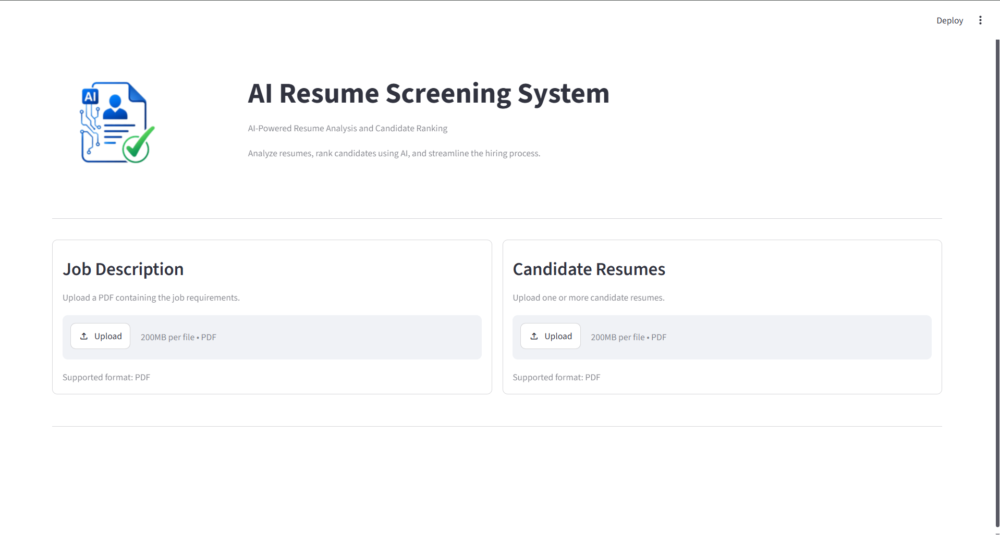
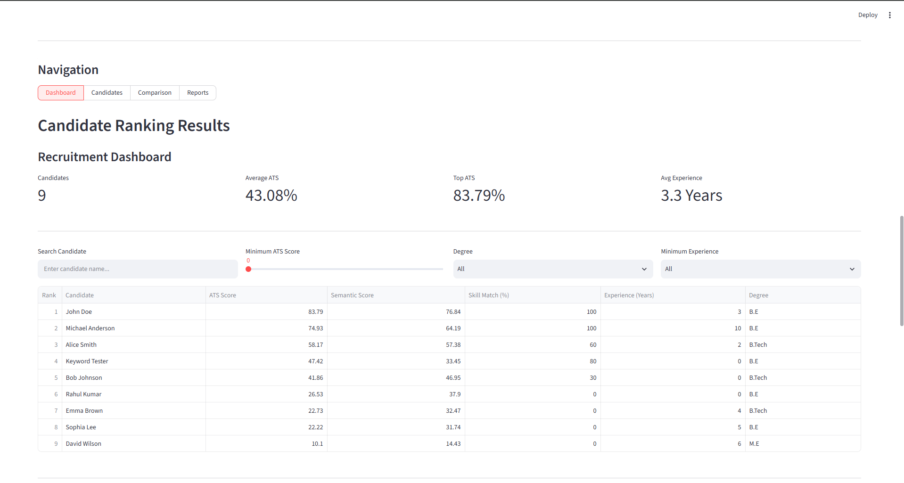
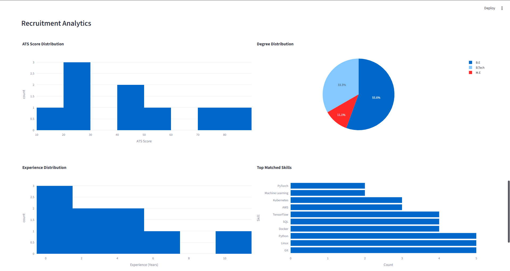
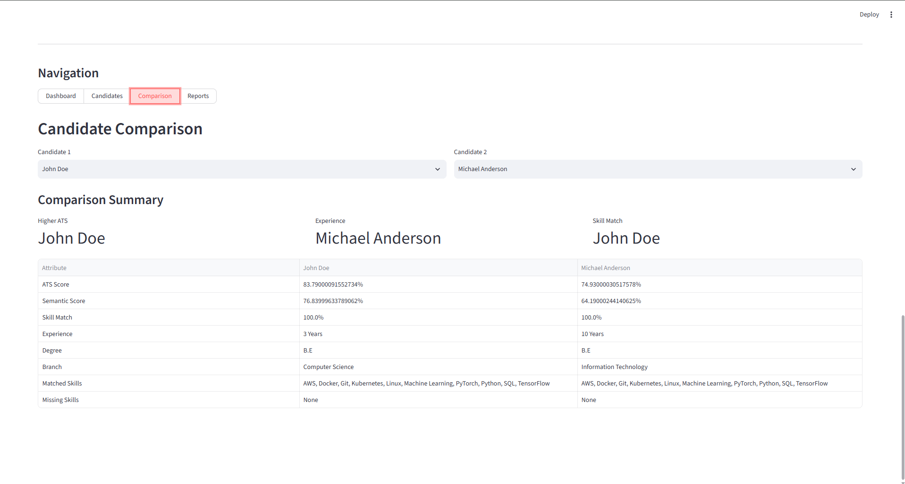
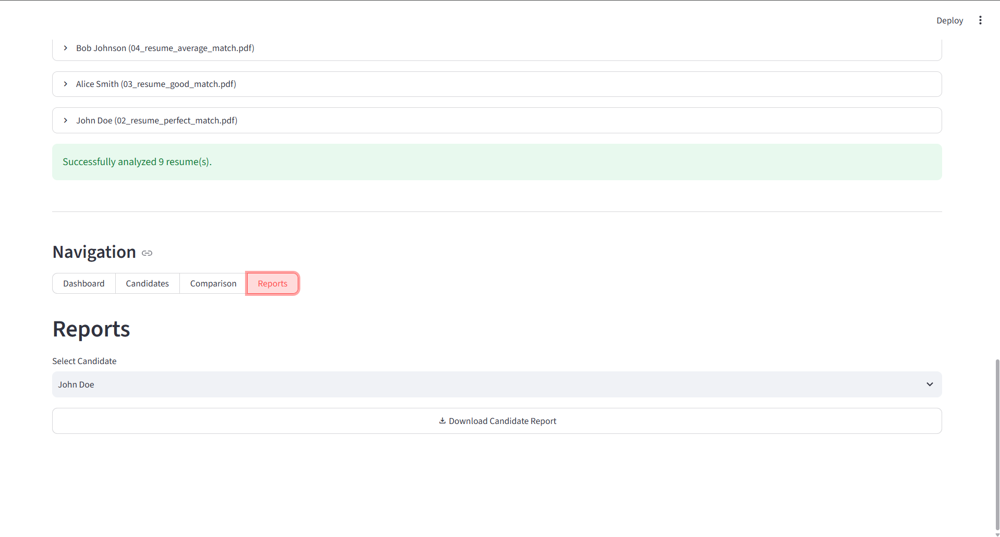

# AI Resume Screening System

An intelligent, AI-powered Applicant Tracking System (ATS) built with **Python**, **Streamlit**, and **Sentence Transformers**. The application automates resume screening by analyzing, ranking, and comparing candidate resumes against a job description using semantic similarity, skill matching, and resume analysis. It also generates professional recruiter-ready PDF reports to streamline the hiring process.

[](https://ai-resume-screener-hcwkeqeyb8jvef8he7pivc.streamlit.app/)
[](https://github.com/ankith0921/AI-Resume-Screener)


---

## Overview

Recruiters often spend significant time manually reviewing resumes to identify suitable candidates. This project automates that process by leveraging **Natural Language Processing (NLP)** and **Sentence Transformer embeddings** to compare resumes with a job description.

The system extracts candidate information, evaluates resume relevance using semantic similarity, calculates an ATS score, identifies skill gaps, ranks candidates, and generates professional PDF reports.

> **Note:** The first launch may take **30–60 seconds** while the Sentence Transformer model is downloaded and cached.

---

# Features

### Resume Processing

- Upload Job Description (PDF)
- Upload Multiple Candidate Resumes (PDF)
- Automatic Resume Parsing
- Candidate Information Extraction
- Education Parsing
- Experience Extraction
- Skill Extraction

---

### AI Resume Analysis

- Semantic Similarity Matching
- ATS Score Calculation
- Skill Match Percentage
- Missing Skills Identification
- AI Candidate Summary
- Hiring Recommendation

---

### Dashboard

- Candidate Ranking
- Search Candidates
- Degree Filter
- Experience Filter
- ATS Score Filter
- Interactive Analytics
- CSV Export

---

### Candidate Details

- Personal Information
- Education Details
- Performance Metrics
- Skills Analysis
- Resume Summary
- Hiring Recommendation

---

### Candidate Comparison

- Compare Two Candidates
- ATS Score Comparison
- Experience Comparison
- Skill Match Comparison
- Side-by-Side Analysis

---

### PDF Reports

Generate recruiter-ready PDF reports containing:

- Candidate Information
- Education Details
- Performance Scores
- Skills Analysis
- AI Candidate Summary
- Hiring Recommendation
- Professional Formatting
- Automatic Page Numbers

---

# Screenshots

## Home



---

## Dashboard



---

## Analytics



---

## Candidate Details


---

## Candidate Comparison



---

## Reports



---

## Sample PDF Report


---

# Project Structure

```text
AI-Resume-Screener/
│
├── app.py
├── requirements.txt
├── README.md
│
├── assets/
│   ├── logo.png
│   └── screenshots/
│
├── components/
│   ├── dashboard.py
│   ├── candidates.py
│   ├── comparison.py
│   └── reports.py
│
├── resumes/
│
├── utils/
│   ├── ats_score.py
│   ├── degree_mapping.py
│   ├── education.py
│   ├── embeddings.py
│   ├── experience.py
│   ├── feedback.py
│   ├── helpers.py
│   ├── parser.py
│   ├── pdf_reader.py
│   ├── ranking.py
│   ├── ranking_engine.py
│   ├── recommendation.py
│   ├── report_generator.py
│   ├── skills.py
│   └── summary.py
```

---

# Tech Stack

| Category | Technologies |
|----------|--------------|
| **Programming Language** | Python |
| **Framework** | Streamlit |
| **AI / NLP** | Sentence Transformers, Semantic Similarity, NLP |
| **Data Processing** | Pandas, Scikit-learn |
| **Visualization** | Plotly |
| **PDF Processing** | PyMuPDF, ReportLab |

---

# Installation

### Clone the repository

```bash
git clone https://github.com/ankith0921/AI-Resume-Screener.git
```

### Navigate to the project

```bash
cd AI-Resume-Screener
```

### Create a virtual environment

```bash
python -m venv venv
```

### Activate the environment

**Windows**

```bash
venv\Scripts\activate
```

**Linux / macOS**

```bash
source venv/bin/activate
```

### Install dependencies

```bash
pip install -r requirements.txt
```

---

# Running the Application

```bash
streamlit run app.py
```

The application opens automatically at:

```text
http://localhost:8501
```

---

# How It Works

1. Upload a Job Description (PDF)
2. Upload one or more candidate resumes
3. Resume text is extracted
4. Candidate information is parsed
5. Sentence embeddings are generated
6. Semantic similarity is calculated
7. ATS score is computed
8. Skill match percentage is calculated
9. Candidates are ranked automatically
10. Recruiters can compare candidates and generate PDF reports

---

# ATS Scoring

The ATS score combines multiple factors:

- Semantic similarity between the resume and job description
- Skill match percentage
- Relevant work experience

### Hiring Recommendation

| ATS Score | Recommendation |
|-----------|---------------|
| **75% and above** | 🟩 Recommended |
| **55% – 74%** | 🟨 Consider |
| **Below 55%** | 🟥 Not Recommended |

---

# PDF Report

Each generated report contains:

- Candidate Information
- Education Details
- ATS Score
- Semantic Similarity Score
- Skill Match Percentage
- Experience
- Skills Analysis
- AI Candidate Summary
- Hiring Recommendation
- Professional Formatting
- Automatic Page Numbers

---

# Future Improvements

- LLM-powered candidate evaluation
- Resume improvement suggestions
- Recruiter authentication
- Database integration
- Resume keyword highlighting
- DOCX resume support
- Multi-language resume support
- REST API integration
- Docker support

---

# About the Author

## Ankith Kanthyappa Nataraj

Computer Science Engineering Graduate with interests in:

- Artificial Intelligence
- Machine Learning
- Natural Language Processing
- Data Science
- Software Engineering

**GitHub**

https://github.com/ankith0921

**LinkedIn**

https://www.linkedin.com/in/ankith-kn-9b7a6329b

---

# License

This project is licensed under the **MIT License**.

See the `LICENSE` file for details.